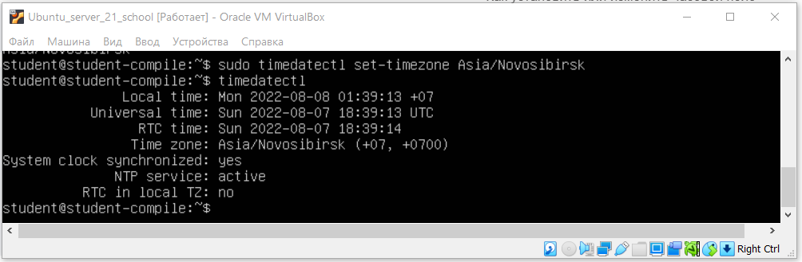
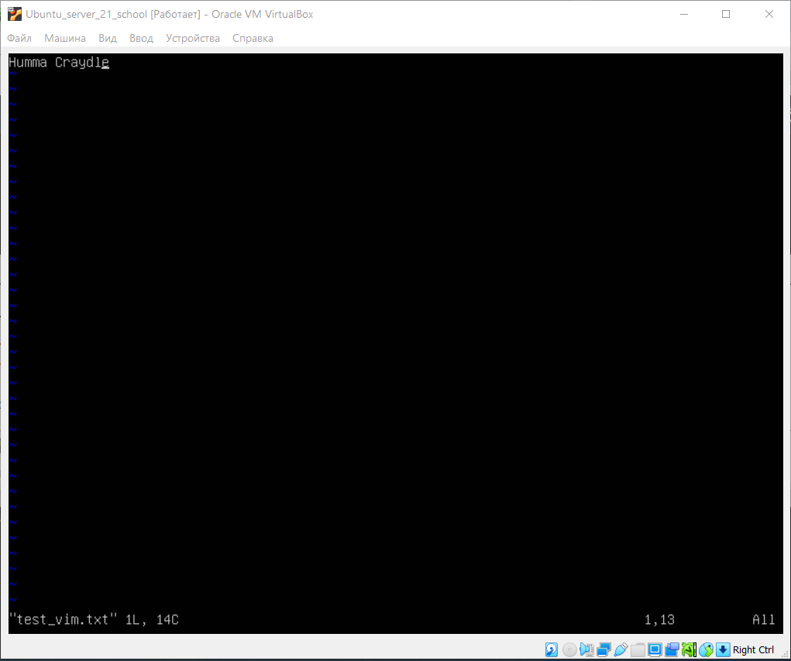
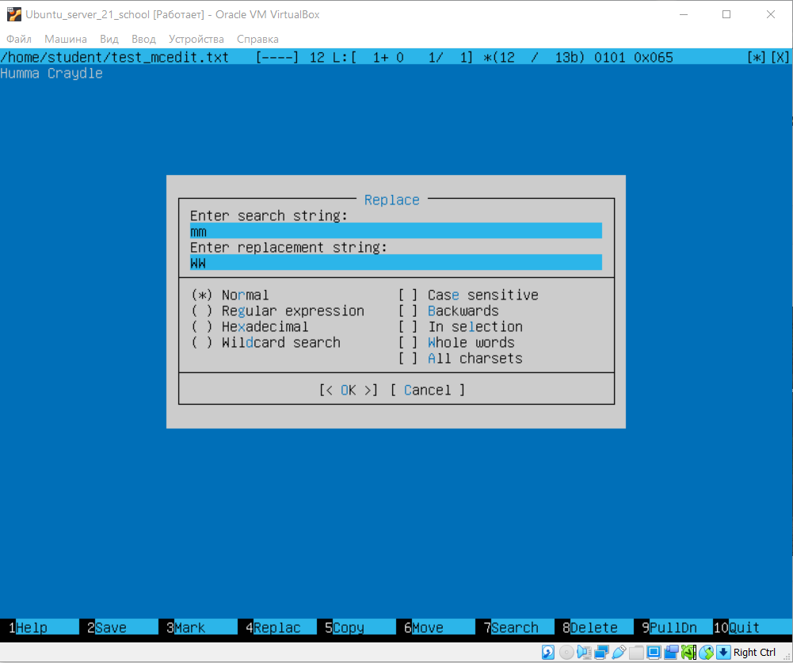
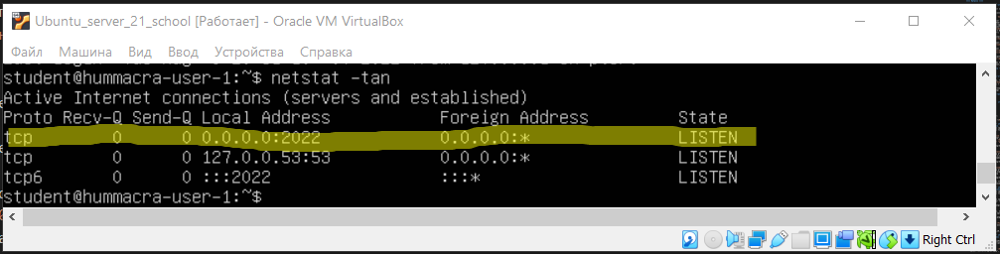
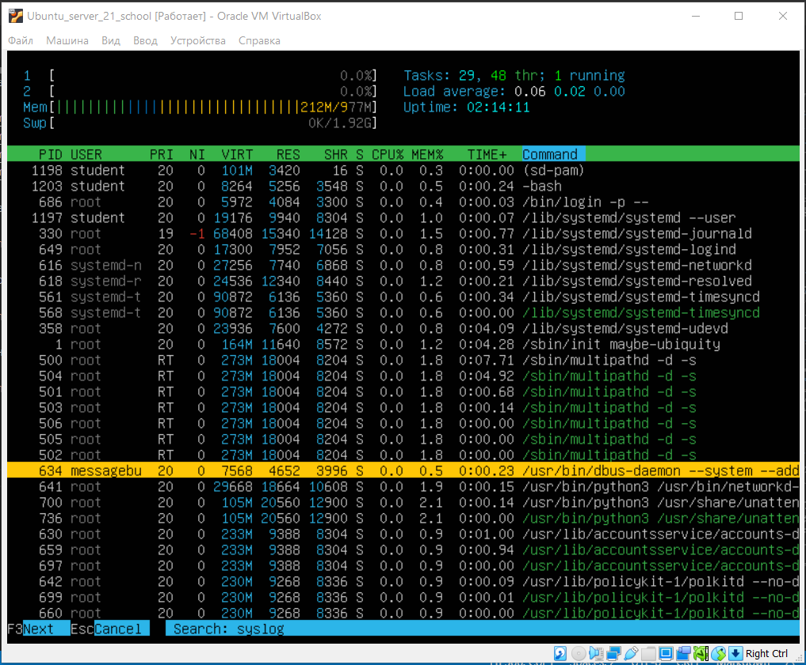
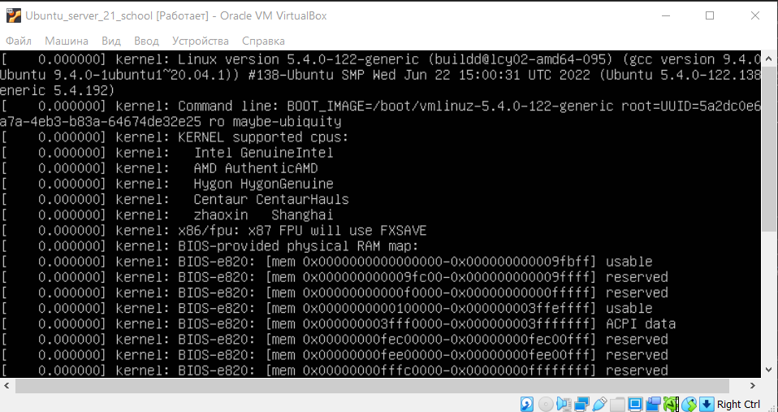

# Операционные системы UNIX/Linux (Базовый).

## Contents

[Chapter III](#chapter-iii) \
    1 [Установка ОС](#part-1-установка-ос)  
    2 [Создание пользователя](#part-2-создание-пользователя)  
    3 [Настройка сети ОС](#part-3-настройка-сети-ос)   
    4 [Обновление ОС](#part-4-обновление-ос)  
    5 [Использование команды  sudo](#part-5-использование-команды-sudo)  
    6 [Установка и настройка службы времени](#part-6-установка-и-настройка-службы-времени)  
    7 [Установка и использование текстовых редакторов](#part-7-установка-и-использование-текстовых-редакторов)  
    8 [Установка и базовая настройка сервиса SSHD](#part-8-установка-и-базовая-настройка-сервиса-sshd)   
    9 [Установка и использование утилит top, htop](#part-9-установка-и-использование-утилит-top-htop)   
    10 [Использование утилиты fdisk](#part-10-использование-утилиты-fdisk)   
    11 [Использование утилиты df](#part-11-использование-утилиты-df)    
    12 [Использование утилиты du](#part-12-использование-утилиты-du)    
    13 [Установка и использование утилиты ncdu](#part-13-установка-и-использование-утилиты-ncdu)    
    14 [Работа с системными журналами](#part-14-работа-с-системными-журналами)     
    15 [Использование планировщика заданий CRON](#part-15-использование-планировщика-заданий-cron)    

## Chapter

В качестве результата работы должен быть предоставлен отчет по выполненным задачам. В каждой части задания указано, что должно быть помещено в отчёт после её выполнения. Это могут быть скриншоты, какие-то данные и т.д.
- В репозиторий, в папку src, должен быть загружен отчёт с расширением .md.
- В отчёте должны быть выделены все части задания, как заголовки 2-го уровня.
- В рамках одной части задания всё, что помещается в отчёт, должно быть оформлено в виде списка.
- Каждый скриншот в отчёте должен быть кратко подписан (что показано на скриншоте).
- Все скриншоты обрезаны так, чтобы была видна только нужная часть экрана.

## Part 1. Установка ОС

**== Задание ==**

##### Установить **Ubuntu 20.04 Server LTS** без графического интерфейса. (Используем программу для виртуализации - VirtualBox)

- Графический интерфейс должен отсутствовать.
- Узнайте версию Ubuntu, выполнив команду `cat /etc/issue.`
- Вставьте скриншот с выводом команды.

Версия ОС:


## Part 2. Создание пользователя

**== Задание ==**

##### Создать пользователя, отличного от пользователя, который создавался при установке. Пользователь должен быть добавлен в группу `adm`.

- Вставьте скриншот вызова команды для создания пользователя.
- Новый пользователь должен быть в выводе команды `cat /etc/passwd`
- Вставьте скриншот с выводом команды.

Создание пользователя и добавление в группу `adm`:


Просмотр пользователя командой `cat /etc/passwd`:


## Part 3. Настройка сети ОС

**== Задание ==**

##### 3.1 Задать название машины вида user-1 

Первоначальное название машины:
 

Редактирование файла /etc/hostname :


Редактирование файла /etc/hosts :


Название машины после перезагрузки:


##### 3.2 Установить временную зону, соответствующую вашему текущему местоположению.  

Проверка текущего часового пояса:


Установка нового часового пояса и проверка результата:


##### 3.3 Вывести названия сетевых интерфейсов с помощью консольной команды.
- В отчёте дать объяснение наличию интерфейса lo.  

Вывод названия сетевых интерфейсов с помощью команды ip:


__lo (loopback device)__ – виртуальный интерфейс, присутствующий по умолчанию в любом Linux. Он используется для отладки сетевых программ и запуска серверных приложений на локальной машине. С этим интерфейсом всегда связан адрес 127.0.0.1. У него есть dns-имя – *localhost*.

##### 3.4 Используя консольную команду получить ip адрес устройства, на котором вы работаете, от DHCP сервера. 
- В отчёте дать расшифровку DHCP.  

Получение ip-адреса устройства от DHCP сервера:


**DHCP** — сетевой протокол, позволяющий сетевым устройствам автоматически получать IP-адрес и другие параметры, необходимые для работы в сети TCP/IP. Данный протокол работает по модели «клиент-сервер».

##### 3.5 Определить и вывести на экран внешний ip-адрес шлюза (ip) и внутренний ip-адрес шлюза, он же ip-адрес по умолчанию (gw). 

Просмотр текущего ip адреса шлюза и ip адреса по умолчанию (gw):


Просмотр внутреннего ip адреса шлюза:


##### 3.6 Задать статичные (заданные вручную, а не полученные от DHCP сервера) настройки ip, gw, dns (использовать публичный DNS серверы, например 1.1.1.1 или 8.8.8.8).  

Задание статичных настроек сети:


Определение нового dns (редактирование файла `/etc/resolv.conf`):


##### 3.7 Перезагрузить виртуальную машину. Убедиться, что статичные сетевые настройки (ip, gw, dns) соответствуют заданным в предыдущем пункте.  

Просмотр сетевых настроек после перезагрузки:


- Успешно пропинговать удаленные хосты 1.1.1.1 и ya.ru и вставить в отчёт скрин с выводом команды. В выводе команды должна быть фраза "0% packet loss".


## Part 4. Обновление ОС

**== Задание ==**

##### Обновить системные пакеты до последней на момент выполнения задания версии.  

- После обновления системных пакетов, если ввести команду обновления повторно, должно появится сообщение, что обновления отсутствуют.
- Вставить скриншот с этим сообщением в отчёт.

1. Обновляем списки пакетов, доступные в репозитории:
    ```sudo apt update```
2. Выполняем команду для обновления системы:
    ```sudo apt upgrade```

После обновления еще раз запускаем эти команды, чтобы убедиться, что обновлений больше нет:


## Part 5. Использование команды **sudo**

**== Задание ==**

##### Разрешить пользователю, созданному в [Part 2](#part-2-создание-пользователя), выполнять команду sudo.

1. В отчёте объяснить *истинное* назначение команды sudo (про то, что это слово - "волшебное", писать не стоит).  
2. Поменять `hostname ОС` от имени пользователя, созданного в пункте [Part 2](#part-2-создание-пользователя) (используя sudo).
3. Вставить скрин с изменённым `hostname` в отчёт.

- **sudo** (англ. Substitute User and do, дословно «подменить пользователя и выполнить») — программа для системного администрирования UNIX-систем, позволяющая делегировать те или иные привилегированные ресурсы пользователям с ведением протокола работы. Основная идея — дать пользователям как можно меньше прав, при этом достаточно для решения поставленных задач. Программа поставляется для большинства UNIX и UNIX-подобных операционных систем. Команда `sudo` предоставляет возможность пользователям выполнять команды от имени суперпользователя `root`, либо других пользователей. Правила, используемые `sudo` для принятия решения о предоставлении доступа, находятся в файле `/etc/sudoers`.

- проверить права доступа к файлам `/etc/hostname` и `/etc/hosts`:\
    ```ls -l /etc/hostname /etc/hosts```

    выдать права на запись в файл:\
    ```sudo chmod 777 /etc/hostname /etc/hosts```

    от имени другого пользователя открыть файлы для редактирования , внести в них новое название машины: \
    ```sudo -u hummacra vim /etc/hostname``` \
    ```sudo -u hummacra vim /etc/hosts```

    Скриншот с выполненными командами:
    

- Изменённый `hostname` после перезагрузки:


## Part 6. Установка и настройка службы времени

**== Задание ==**

##### Настроить службу автоматической синхронизации времени.  

1. Вывести время часового пояса, в котором вы сейчас находитесь.
2. Вывод команды `timedatectl show` должен содержать `NTPSynchronized=yes`: \
3. Вставить скрины с корректным временем и выводом команды в отчёт.

- Скриншот с командами для выполнения:


## Part 7. Установка и использование текстовых редакторов 

**== Задание ==**

##### 7.1 Установить текстовые редакторы **VIM** (+ любые два по желанию **NANO**, **MCEDIT**, **JOE** и т.д.)  

Установка редакторов: \
```sudo apt install vim``` \
```sudo apt install nano``` \
```sudo apt install mcedit```

Версии установленных редакторов:

  

##### 7.2 Используя каждый из трех выбранных редакторов, создайте файл *test_X.txt*, где X -- название редактора, в котором создан файл. Напишите в нём свой никнейм, закройте файл с сохранением изменений.  
- В отчёт вставьте скриншоты из каждого редактора с содержимым файла перед закрытием.
- В отчёте укажите, что сделали для выхода с сохранением изменений.

  -  **Vim**: \
    Создание файла - команда `vim test_vim.txt`; \
    Редактирование текста - нажать клавишу `<Insert>`, набрать с клавиатуры нужные символы; \
    Сохранение текста - нажать `<Esc>`, чтобы перейти в командный режим, затем `":" + "w"`; \
    Выход из редактора - `":" + "q"`.

    

  -  **Nano**: \
    Создание файла - команда `nano test_nano.txt`; \
    Редактирование текста - набрать с клавиатуры нужные символы; \
    Сохранение текста - нажать комбинацию клавиш `<Ctrl> + "o"`, затем подтвердить выбранное имя файла; \
    Выход из редактора - комбинация клавиш `<Ctrl> + "x"`.

    

  -  **MCEdit**: \
    Создание файла - команда `mcedit test_mcedit.txt`; \
    Редактирование текста - набрать с клавиатуры нужные символы; \
    Сохранение текста - нажать клавишу `<F2>`, затем подтвердить сохранение нажатием на клавишу `<Enter>`;\
    Выход из редактора - клавиша `<F10>`.

    

Список файлов, полученных после выполнения задания:

    
##### 7.3 Используя каждый из трех выбранных редакторов, откройте файл на редактирование, отредактируйте файл, заменив никнейм на строку "21 School 21", закройте файл без сохранения изменений.
- В отчёт вставьте скриншоты из каждого редактора с содержимым файла после редактирования.
- В отчёте укажите, что сделали для выхода без сохранения изменений.

  -  **Vim**: \
    После редактирования текста нажать клавшишу `<Esc>`, чтобы перейти в командный режим. Для выхода без сохранения нажать `":" + "q" + "!". Всё, вы вышли.

    

  -  **Nano**: \
    Для выхода нажать комбинацию клавиш `<Ctrl> + "x"`. Появится сообщение о том, что есть несохраненные изменения в файле. В ответ нажать `<N>`, т.е. "No" (выйти без сохранения). 

    

  -  **MCEdit**: \
    Для выхода нажать клавишу `<F10>`. Появится сообщение о том, что есть несохраненные изменения в файле. В ответ нажать `<N>` (или стрелками на клавиатуре передвинуть графический указатель на кнопку "No" и нажать `<Enter>`). 

    

##### 7.4 Используя каждый из трех выбранных редакторов, отредактируйте файл ещё раз (по аналогии с предыдущим пунктом), а затем освойте функции поиска по содержимому файла (слово) и замены слова на любое другое.
- В отчёт вставьте скриншоты:
    - Из каждого редактора с результатами поиска слова.
    - Из каждого редактора с командами, введёнными для замены слова на другое.

-  **Vim**: \
    Для поиска и замены нажать `<Esc>` (переход в командный режим), затем `":" + "s"` и задать шаблон для поиска/замены символов, затем нажать клавишу `<Enter>`. Произойдет замена первого вхождения заданного шаблона.

    

-  **Nano**: \
    Для поиска и замены нажать комбинацию клавиш `<Ctrl> + "\"`, строку для поиска и нажать `<Enter>`, затем задать строку для замены и нажать `<Enter>`, затем подтвердить действие нажатием клавиши `<Y>`. 

        

-  **MCEdit**: \
    Для поиска и замены нажать клавишу `<F4>`, задать строку для поиска, строку для замены (при необходимости), нажать `<Enter>`. В следующем окне выбрать режим замены (однократная замена, замена всех вхождений, пропуск, отмена).

    

## Part 8. Установка и базовая настройка сервиса **SSHD**

**== Задание ==**

##### 8.1 Установить службу SSHd.  

Установка службы с помощью пакетного менеджера:\
```sudo apt install openssh-server```

##### 8.2 Добавить автостарт службы при загрузке системы.  

Добавление службы в автозапуск:\
```sudo systemctl enable ssh.service```

##### 8.3 Перенастроить службу SSHd на порт 2022.  

- Открываем в текстовом редакторе конфигурационный файл службы:\
    ```sudo vim /etc/ssh/sshd_config```

- Находим нужную строчку и меняем значение порта на 2022:\
    

##### 8.4 Используя команду ps, показать наличие процесса sshd. Для этого к команде нужно подобрать ключи.
- В отчёте объяснить значение команды и каждого ключа в ней.

Используем команду для вывода запущенных процессов: \
```ps axfv | grep sshd```

Значение ключей:\
- `a` - выбрать все процессы, кроме фоновых;
- `x` - выбрать процессы, отсоединённые от терминала;
- `f` - вывод расширенной информации о процессах (строит визуальную иерархию главных и дочерних процессов);
- `v` - отображает подробные данные о памяти процесса (virtual memory format, total VM size in KiB).

Вывод команды `ps axfv` перенаправляется в `grep sshd` для фильтрации и вывода только строк, содержащих **sshd**. 

Список запущенных процессов утилиты `sshd`:


##### 8.5 Перезагрузить систему.
- В отчёте опишите, что сделали для выполнения всех пяти пунктов (можно как текстом, так и скриншотами).

    Для перезагрузки системы - команда ```reboot```.

- Вывод команды `netstat -tan` должен содержать  \
`tcp 0 0 0.0.0.0:2022 0.0.0.0:* LISTEN`  \
(если команды `netstat` нет, то ее нужно установить)
- Скрин с выводом команды вставить в отчёт.

    Скриншот с выводом команды `netstat -tan`:
    

- В отчёте объяснить значение ключей `-tan`, значение каждого столбца вывода, значение `0.0.0.0`.

Значение ключей: \
    - `t` - отображает только tcp-соединения; \
    - `a` - получить информацию о процессах, которые активных соединений не имеют, но слушают порты; \
    - `n` - показывать ip адрес, а не сетевое имя.

Значение столбцов в выводе: \
    - `PROTO` - протокол соединения, используемый сокетом; \
    - `Recv-Q` - если соединение установлено, содержит число байт, доступных для получения клиентским приложением, работающим с этим сокетом. Если порт находится в состоянии *LISTEN*, то содержит количество ожидающих запросов на соединение в очереди; \
    - `Send-Q` - если соединения установлено, содержит число байт, которые еще не были переданы удаленной машине, работающей с этим сокетом. Если порт находится в состоянии *LISTEN*, то содержит максимально возможное количество ожидающих запросов на соединение; \
    - `Local Address` - адрес и номер порта локального конца сокета; \
    - `Foreign Address` - адрес и номер порта удаленного конца сокета; \
    - `State` - состояние сокета (состояние *LISTEN* означает, что сокет прослушивает входящие соединения).

Значение `0.0.0.0`: нулевой адрес сокета (*0.0.0.0* или *:::*) говорит о том, что подключение отсутствует.

## Part 9. Установка и использование утилит **top**, **htop**

**== Задание ==**

##### Установить и запустить утилиты top и htop.  

`top` - стандартная системная утилита, которая доступна во всех дистрибутивах Linux/Unix.

Команда для установки и запуска утилиты `htop`: ```sudo apt-get install htop```

Работа утилиты `top`:


- По выводу команды top определить и написать в отчёте:
  - uptime - *1:41*;
  - количество авторизованных пользователей - *1 user*;
  - общая загрузка системы - *0.00, 0.00, 0.00*;
  - общее количество процессов - *112 total*;
  - загрузка cpu - *0.0 us, 0.3 sy, 0.0 ni, 99.7 id, 0.0 wa, 0.0 hi, 0.0 si, 0.0 st*;
  - загрузка памяти - *976.6 total, 110.3 free, 210.9 used, 655.4 buff/cache (MiB)*;
  - pid процесса занимающего больше всего памяти - *500*;
  - pid процесса, занимающего больше всего процессорного времени - *354*.


- В отчёт вставить скрин с выводом команды `htop`:

  - отсортированному по PID, PERCENT_CPU, PERCENT_MEM, TIME:

    
    
    
       

  - отфильтрованному для процесса `sshd`:

    

  - с процессом `syslog`, найденным используя поиск:

    

  - с добавленным выводом `hostname`, `clock` и `uptime`:

    

## Part 10. Использование утилиты **fdisk**

**== Задание ==**

##### Запустить команду fdisk -l.

Результат выполнения команды:


- В отчёте написать название жесткого диска, его размер и количество секторов, а также размер `swap`.

  - название жесткого диска: *dev/sda2*;
  - размер: *16G*;
  - количество секторов: *33548288*;
  - размер `swap`: *0G*.

## Part 11. Использование утилиты **df** 

**== Задание ==**

##### 11.1 Запустить команду df .  

Результат выполнения команды:


- В отчёте написать для корневого раздела (/): 
  - размер раздела: *16G*;
  - размер занятого пространства: *6.8G*;
  - размер свободного пространства: *8.1G*;
  - процент использования: *46%*.

- Определить и написать в отчёт единицу измерения в выводе.  \
  Вывод происходит в человекочитаемом формате (задано ключом `-h`), единицы измерения - гигабайты (G).

##### 11.2 Запустить команду df -Th .

Результат выполнения команды:


- В отчёте написать для корневого раздела (/): 
  - размер раздела: *16G*;
  - размер занятого пространства: *6.8G*;
  - размер свободного пространства: *8.1G*;
  - процент использования: *46%*.

- Определить и написать в отчёт тип файловой системы для раздела. \
  Тип файловой системы - `ext4` (ключ `-T` выводит информацию о файловой системе).


## Part 12. Использование утилиты **du**

**== Задание ==**

##### 12.1 Запустить команду du.

Синтаксис команды очень простой. Вам достаточно передать ей опции и путь к папке с которой следует работать:

```du опции /путь/к/папке```

Например:

```du -h /home```

##### 12.2 Вывести размер папок /home, /var, /var/log (в байтах, в человекочитаемом виде)

По умолчанию размер выводится в байтах. Для того чтобы размер выводился в более читабельном виде используется ключ `-h`, или можно указать размер блока (тогда точность будет немного ниже, потому что минимальная единица измерения - один блок). Например, для вывода размера папок в мегабайтах с размером блока в 1024 килобайт служит ключ `-B` с параметром `M`. Ключ `-d` служит для определения глубины вложенности директорий, для которых выводится итоговый размер файлов.

Команда для выполнения задания:

```sudo du -hd1 /home /var/log /var```

Результат выполнения команды:


##### 12.3 Вывести размер всего содержимого в /var/log (не общее, а каждого вложенного элемента, используя *)

Команда для выполнения задания:

```sudo du -hs /var/log/* ```

(ключ `-s`, `--summarize` - выводить только общий размер).

Результат выполнения команды:


- В отчёт вставить скрины с выводом всех использованных команд.

## Part 13. Установка и использование утилиты **ncdu**

**== Задание ==**

##### 13.1 Установить утилиту ncdu.

Установка утилиты `ncdu`:


##### 13.2 Вывести размер папок /home, /var, /var/log.

- Размеры должны примерно совпадать с полученными в [Part 12](#part-12-использование-утилиты-du).

- В отчёт вставить скрины с выводом использованных команд.

  Размеры папок, полученные командой `ncdu`:
  
  
  

## Part 14. Работа с системными журналами

**== Задание ==**

##### Открыть для просмотра:
##### 1. /var/log/dmesg

`/var/log/dmesg` - содержит сообщения, полученные от ядра. Регистрирует много сообщений еще на этапе загрузки, в них отображается информация об аппаратных устройствах, которые инициализируются в процессе загрузки. Количество сообщений в логе ограничено, и когда файл будет переполнен, с каждым новым сообщением старые будут перезаписаны.

Команда для просмотра с возможностью прокрутки:

```less /var/log/dmesg```

Результат выполнения команды:


##### 2. /var/log/syslog

`/var/log/syslog` - Файлы системного журнала записывают различные сообщения, полезные для отладки. Если вы не можете найти определенные сообщения журнала в других файлах, скорее всего, они могут быть в файлах системного журнала.

Команды для просмотра текущего файла системного журнала:

```cat /var/log/syslog```

Результат выполнения команды:


##### 3. /var/log/auth.log  

`/var/log/auth.log` - Журналы авторизации или просто журналы «Auth» записывают попытки удаленного входа в систему и запросы пароля, запрашиваемые командой `sudo`. 

Команда для просмотра журнала:

```cat /var/log/auth.log```

Результат выполнения команды:


- Написать в отчёте:
  - время последней успешной авторизации: *00:59:59*;
  - имя пользователя: *student*;
  - метод входа в систему: *LOGIN*.

- Перезапустить службу SSHd.

  Команда для перезапуска службы SSHd:
  ```sudo systemctl restart ssh.service```

- Вставить в отчёт скрин с сообщением о рестарте службы (искать в логах).

  Вывод последних пяти записей в */var/log/syslog*:

  ```sudo tail -n 5 /var/log/syslog```   

  

## Part 15. Использование планировщика заданий **CRON**

**== Задание ==**

##### 15.1 Используя планировщик заданий, запустите команду uptime через каждые 2 минуты.

  Команда для просмотра задач `crontab`, активных в данный момент в системе:
  ```sudo crontab -l```

  Команда для реадктирования списка заданий:

  ```crontab -e```

  Команда для запуска `uptime` через каждые 2 минуты:

  ```*/2 * * * * uptime```

  Скриншот окна редактирования списка заданий `crontab`:
  

- Найти в системных журналах строчки (минимум две в заданном временном диапазоне) о выполнении:

  

- Вывести на экран список текущих заданий для CRON:
  

- Вставить в отчёт скрины со строчками о выполнении и списком текущих задач.

##### 15.2 Удалите все задания из планировщика заданий.

Для удаления всех заданий из планировщика заданий:
  - открыть список задач для редактирования ```crontab -e```;
  - стереть все строчки с заданиями, сохранить файл и выйти.

  Скриншот после удаления задачи:
  

- В отчёт вставьте скрин со списком текущих заданий для CRON.


