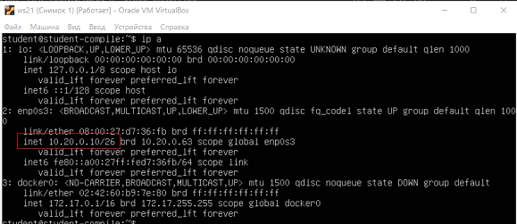
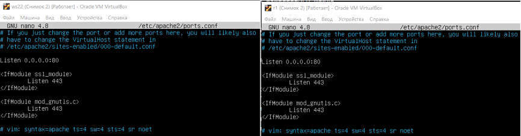

# Сети в Linux

Настройка сетей в Linux на виртуальных машинах.


## Contents

1. [Инструмент ipcalc](#part-1-инструмент-ipcalc) 
2. [Статическая маршрутизация между двумя машинами](#part-2-статическая-маршрутизация-между-двумя-машинами) 
3. [Утилита iperf3](#part-3-утилита-iperf3) 
4. [Сетевой экран](#part-4-сетевой-экран) 
5. [Статическая маршрутизация сети](#part-5-статическая-маршрутизация-сети) 
6. [Динамическая настройка IP с помощью DHCP](#part-6-динамическая-настройка-ip-с-помощью-dhcp) 
7. [NAT](#part-7-nat) 
8. [Допополнительно. Знакомство с SSH Tunnels](#part-8-дополнительно-знакомство-с-ssh-tunnels)


## Part 1. Инструмент **ipcalc**

**== Задание ==**

##### Поднять виртуальную машину (далее -- ws1)

#### 1.1. Сети и маски
##### Определить и записать в отчёт:
##### 1) адрес сети *192.167.38.54/13*

**Ответ:**<br>

<br>1) из скриншота видно, что адрес сети (Network) 192.160.0.0.

##### 2) перевод маски *255.255.255.0* в префиксную и двоичную запись, */15* в обычную и двоичную, *11111111.11111111.11111111.11110000* в обычную и префиксную

**Ответ:**
- *255.255.255.0* --> /24 (префиксная запись) --> 11111111.11111111.11111111.00000000 (двоичная запись);
- */15* --> 255.254.0.0 (обычная запись) --> 11111111.11111110.00000000.00000000 (двоичная запись);
- *11111111.11111111.11111111.11110000* --> 255.255.255.240 (обычная запись) --> /28 (префиксная запись).

##### 3) минимальный и максимальный хост в сети *12.167.38.4* при масках: */8*, *11111111.11111111.00000000.00000000*, *255.255.254.0* и */4*

**Ответ:**
- сеть *12.167.38.4*:
  - при маске */8* : 
      - минимальный хост - 12.0.0.1
      - максимальный хост - 12.255.255.254
  - при маске *11111111.11111111.00000000.00000000* :
      - минимальный хост - 12.167.0.1
      - максимальный хост - 12.167.255.254
  - при маске *255.255.254.0* :
      - минимальный хост - 12.167.38.1
      - максимальный хост - 12.167.39.254
  - при маске */4* :
      - минимальный хост - 0.0.0.1
      - максимальный хост - 15.255.255.254

#### 1.2. localhost
##### Определить и записать в отчёт, можно ли обратиться к приложению, работающему на localhost, со следующими IP: *194.34.23.100*, *127.0.0.2*, *127.1.0.1*, *128.0.0.1*

**Ответ:**
*localhost* - это альтернативный способ обратиться к адресу *127.0.0.1*. Можно сказать, что это его синоним. Диапазон IP-адресов, которые предназначены для создания локальных сетей *127.0.0.1 - 127.255.255.255*. Значит, к приложению, работающему на localhost обратиться по IP
- *194.34.23.100* : нет, нельзя
- *127.0.0.2* : да, можно
- *127.1.0.1* : да, можно
- *128.0.0.1* : нет, нельзя

#### 1.3. Диапазоны и сегменты сетей
##### Определить и записать в отчёт:
##### 1) какие из перечисленных IP можно использовать в качестве публичного, а какие только в качестве частных: *10.0.0.45*, *134.43.0.2*, *192.168.4.2*, *172.20.250.4*, *172.0.2.1*, *192.172.0.1*, *172.68.0.2*, *172.16.255.255*, *10.10.10.10*, *192.169.168.1*

**Ответ:**
- *10.0.0.45* - частный
- *134.43.0.2* - публичный
- *192.168.4.2* - частный
- *172.20.250.4* - частный
- *172.0.2.1* - публичный
- *192.172.0.1* - публичный
- *172.68.0.2* - публичный
- *172.16.255.255* - частный
- *10.10.10.10* - частный
- *192.169.168.1* - публичный


<br>2) Пример определения частного/публичного IP с помощью `ipcalc`


##### 2) какие из перечисленных IP адресов шлюза возможны у сети *10.10.0.0/18*: *10.0.0.1*, *10.10.0.2*, *10.10.10.10*, *10.10.100.1*, *10.10.1.255*

**Ответ:**<br>
Сеть *10.10.0.0/18*, у неё возможны IP адреса шлюза: 
- *10.0.0.1* - нет
- *10.10.0.2* - да
- *10.10.10.10* - да
- *10.10.100.1* - нет
- *10.10.1.255* - да

## Part 2. Статическая маршрутизация между двумя машинами

`-` Теперь разберёмся, как связать две машины, используя статическую маршрутизацию.

**== Задание ==**

##### Поднять две виртуальные машины (далее -- ws1 и ws2)

##### С помощью команды `ip a` посмотреть существующие сетевые интерфейсы
- В отчёт поместить скрин с вызовом и выводом использованной команды.

**Ответ:**

\
3) Скриншот с работой двух виртуальных машин и выводами команд `ip a` в них.
<hr>

##### Описать сетевой интерфейс, соответствующий внутренней сети, на обеих машинах и задать следующие адреса и маски: ws1 - *192.168.100.10*, маска */16*, ws2 - *172.24.116.8*, маска */12*
- В отчёт поместить скрины с содержанием изменённого файла *etc/netplan/00-installer-config.yaml* для каждой машины.

**Ответ:**\
\
4) Скриншот с содержанием файла `*etc/netplan/00-installer-config.yaml*` для каждой машины.

##### Выполнить команду `netplan apply` для перезапуска сервиса сети
- В отчёт поместить скрин с вызовом и выводом использованной команды.

**Ответ:**\
\
5) Скриншот с вызовом и выводом команды `sudo netplan --debug apply` для каждой машины и сразу вызов команды `ip a` для контроля. На скриншоте видно, что IP-адреса сменились на назначенные вручную

#### 2.1. Добавление статического маршрута вручную
##### Добавить статический маршрут от одной машины до другой и обратно при помощи команды вида `ip r add`
##### Пропинговать соединение между машинами
- В отчёт поместить скрин с вызовом и выводом использованных команд.

**Ответ:**\
\
6) Скриншот с командой `ip route add...` и `ping...` для каждой из машин

#### 2.2. Добавление статического маршрута с сохранением
##### Перезапустить машины
##### Добавить статический маршрут от одной машины до другой с помощью файла *etc/netplan/00-installer-config.yaml*
- В отчёт поместить скрин с содержанием изменённого файла *etc/netplan/00-installer-config.yaml*.

**Ответ:**\
\
7) Скриншот с содержанием изменённого файла *etc/netplan/00-installer-config.yaml* для каждой из машин.

##### Пропинговать соединение между машинами
- В отчёт поместить скрин с вызовом и выводом использованной команды.

**Ответ:**\
\
8) Скриншот с вызовом и выводом команды `ping` между машинами.

## Part 3. Утилита **iperf3**

**== Задание ==**

*В данном задании используются виртуальные машины ws1 и ws2 из Части 2*

#### 3.1. Скорость соединения
##### Перевести и записать в отчёт: 8 Mbps в MB/s, 100 MB/s в Kbps, 1 Gbps в Mbps

**Ответ:**
- 8 Mbps в MB/s --> `1 MB/s`
- 100 MB/s в Kbps --> `800000 Kbps`
- 1 Gbps в Mbps --> `1000 Mbps`

#### 3.2. Утилита **iperf3**
##### Измерить скорость соединения между ws1 и ws2
- В отчёт поместить скрины с вызовом и выводом использованных команд.

**Ответ:**\

9) Измерение скорости от `ws1` к `ws2` (1.09 Gbits/sec)


10) Измерение скорости от `ws2` к `ws1` (1.14 Gbits/sec)

## Part 4. Сетевой экран

`-` После соединения машин, перед нами стоит следующая задача: контролировать информацию, проходящую по соединению. Для этого используются сетевые экраны.

**== Задание ==**

*В данном задании используются виртуальные машины ws1 и ws2 из Части 2*

#### 4.1. Утилита **iptables**
##### Создать файл */etc/firewall.sh*, имитирующий фаерволл, на ws1 и ws2:
```shell
#!/bin/sh

# Удаление всех правил в таблице "filter" (по-умолчанию).
iptables –F
iptables -X
```
##### Нужно добавить в файл подряд следующие правила:
##### 1) на ws1 применить стратегию когда в начале пишется запрещающее правило, а в конце пишется разрешающее правило (это касается пунктов 4 и 5)
##### 2) на ws2 применить стратегию когда в начале пишется разрешающее правило, а в конце пишется запрещающее правило (это касается пунктов 4 и 5)
##### 3) открыть на машинах доступ для порта 22 (ssh) и порта 80 (http)
##### 4) запретить *echo reply* (машина не должна "пинговаться”, т.е. должна быть блокировка на OUTPUT)
##### 5) разрешить *echo reply* (машина должна "пинговаться")
- В отчёт поместить скрины с содержанием файла */etc/firewall* для каждой машины.

**Ответ:**\
\
11) Скрины с содержанием файла `*/etc/firewall*` для каждой машины

##### Запустить файлы на обеих машинах командами `chmod +x /etc/firewall.sh` и `/etc/firewall.sh`
- В отчёт поместить скрины с запуском обоих файлов.

**Ответ:**\
\
12) Скрины с запуском файла `*/etc/firewall*` для каждой машины. Результат запуска показан в таблице `iptables`.

- В отчёте описать разницу между стратегиями, применёнными в первом и втором файлах.

**Ответ:**\
Разница в стратегиях следующая:
- на машине `ws1` запрещены все пакеты (INPUT, OUTPUT, FORWARD), а затем открыт доступ для пакетов на порт 22 по протоколу ssh и на порт 80 по протоколу http. Далее открыт доступ для *echo reply*. Все остальные порты - остались закрытыми.
- на машине `ws2` наоборот, сразу же разрешены все пакеты, также открыт доступ для пакетов на порт 22 по протоколу ssh и на порт 80 по протоколу http, а затем запрещён доступ для *echo reply*. Все остальные порты так и остались открытыми.

#### 4.2. Утилита **nmap**
##### Командой **ping** найти машину, которая не "пингуется", после чего утилитой **nmap** показать, что хост машины запущен
*Проверка: в выводе nmap должно быть сказано: `Host is up`*
- В отчёт поместить скрины с вызовом и выводом использованных команд **ping** и **nmap**.

**Ответ:**\
\
13) Скрины с вызовом и выводом команд **ping** и **nmap**. Машина `ws1`пингуется, машина `ws2` - нет. Утилита **nmap** на машине `ws1` показывает, что все порты закрыты, на машине `ws2` показывает, что порт открыт (`Host is up`).

##### Сохранить дампы образов виртуальных машин
**p.s. Ни в коем случае не сохранять дампы в гит!**


## Part 5. Статическая маршрутизация сети

`-` Пока что мы соединяли всего две машины, но теперь пришло время для статической маршрутизации целой сети.

**== Задание ==**

Сеть: \


##### Поднять пять виртуальных машин (3 рабочие станции (ws11, ws21, ws22) и 2 роутера (r1, r2))

#### 5.1. Настройка адресов машин
##### Настроить конфигурации машин в *etc/netplan/00-installer-config.yaml* согласно сети на рисунке.
- В отчёт поместить скрины с содержанием файла *etc/netplan/00-installer-config.yaml* для каждой машины.

**Ответ:**\
\
14) Скрины с содержанием файла *etc/netplan/00-installer-config.yaml* для каждой из 5-ти машин.

##### Перезапустить сервис сети. Если ошибок нет, то командой `ip -4 a` проверить, что адрес машины задан верно. Также пропинговать ws22 с ws21. Аналогично пропинговать r1 с ws11.
- В отчёт поместить скрины с вызовом и выводом использованных команд.

**Ответ:**\
\
15) Скрины с вызовом и выводом `ping` команд.

#### 5.2. Включение переадресации IP-адресов.
##### Для включения переадресации IP, выполните команду на роутерах:
`sysctl -w net.ipv4.ip_forward=1`
*При таком подходе переадресация не будет работать после перезагрузки системы.*
- В отчёт поместить скрин с вызовом и выводом использованной команды.

**Ответ:**\
\
16) Скрины с включением переадресации IP на роутерах.

##### Откройте файл */etc/sysctl.conf* и добавьте в него следующую строку:
`net.ipv4.ip_forward = 1`
*При использовании этого подхода, IP-переадресация включена на постоянной основе.*
- В отчёт поместить скрин с содержанием изменённого файла */etc/sysctl.conf*.

**Ответ:**\
\
17) Скрины с содержанием изменённого файла */etc/sysctl.conf* на роутерах.

#### 5.3. Установка маршрута по-умолчанию
Пример вывода команды `ip r` после добавления шлюза:
```
default via 10.10.0.1 dev eth0
10.10.0.0/18 dev eth0 proto kernel scope link src 10.10.0.2
```
##### Настроить маршрут по-умолчанию (шлюз) для рабочих станций. Для этого добавить `default` перед IP роутера в файле конфигураций
- В отчёт поместить скрин с содержанием файла *etc/netplan/00-installer-config.yaml*.

**Ответ:**\
\
18) Скрины с содержанием файла *etc/netplan/00-installer-config.yaml* на рабочих станциях (`ws11`, `ws21`, `ws22`).

##### Вызвать `ip r` и показать, что добавился маршрут в таблицу маршрутизации
- В отчёт поместить скрин с вызовом и выводом использованной команды.

**Ответ:**\
\
19) Скрины с вызовом и выводом команды `ip r` на рабочих станциях (`ws11`, `ws21`, `ws22`).

##### Пропинговать с ws11 роутер r2 и показать на r2, что пинг доходит. Для этого использовать команду:
`tcpdump -tn -i eth1`
- В отчёт поместить скрин с вызовом и выводом использованных команд.

**Ответ:**\
\
20) Скрины с вызовом и выводом команды `tcpdump -tn -i eth1` на роутере `r2`.

#### 5.4. Добавление статических маршрутов
##### Добавить в роутеры r1 и r2 статические маршруты в файле конфигураций. Пример для r1 маршрута в сетку 10.20.0.0/26:
```shell
# Добавить в конец описания сетевого интерфейса eth1:
- to: 10.20.0.0
  via: 10.100.0.12
```
- В отчёт поместить скрины с содержанием изменённого файла *etc/netplan/00-installer-config.yaml* для каждого роутера.

**Ответ:**\
\
21) Скрины с содержанием изменённого файла *etc/netplan/00-installer-config.yaml* для каждого роутера.

##### Вызвать `ip r` и показать таблицы с маршрутами на обоих роутерах. Пример таблицы на r1:
```
10.100.0.0/16 dev eth1 proto kernel scope link src 10.100.0.11
10.20.0.0/26 via 10.100.0.12 dev eth1
10.10.0.0/18 dev eth0 proto kernel scope link src 10.10.0.1
```
- В отчёт поместить скрин с вызовом и выводом использованной команды.

**Ответ:**\
\
22) Скрины с вызовом и выводом команды `ip r` для каждого роутера.

##### Запустить команды на ws11:
`ip r list 10.10.0.0/[маска сети]` и `ip r list 0.0.0.0/0`
- В отчёт поместить скрин с вызовом и выводом использованных команд.
- В отчёте объяснить, почему для адреса 10.10.0.0/\[маска сети\] был выбран маршрут, отличный от 0.0.0.0/0, хотя он попадает под маршрут по-умолчанию.

**Ответ:**\
\
23) Скрин с вызовом и выводом команд `ip r list..` для роутера `r1`.

**Объяснение:**

Есть общий принцип: если есть два и более маршрутов на одну и ту же сеть, то маршрутизация осуществляется по принципу наибольшего совпадения маски. В данном случае на роутер `r1` есть два маршрута - `default` с маской `/0(00000000000000000000000000000000)` и `10.10.0.1` с маской `/18(11111111111111111100000000000000)`. Поэтому для доступа к `10.10.0.0/18` был выбран путь через `10.10.0.1`, а не через `default (0.0.0.0)`.

#### 5.5. Построение списка маршрутизаторов
Пример вывода утилиты **traceroute** после добавления шлюза:
```
1 10.10.0.1 0 ms 1 ms 0 ms
2 10.100.0.12 1 ms 0 ms 1 ms
3 10.20.0.10 12 ms 1 ms 3 ms
```
##### Запустить на r1 команду дампа:
`tcpdump -tnv -i eth0`
##### При помощи утилиты **traceroute** построить список маршрутизаторов на пути от ws11 до ws21
- В отчёт поместить скрины с вызовом и выводом использованных команд (tcpdump и traceroute).
- В отчёте, опираясь на вывод, полученный из дампа на r1, объяснить принцип работы построения пути при помощи **traceroute**.

**Ответ:**\
\
24) Скрин с вызовом и выводом команд `tcpdump` на `r1` и `traceroute` на `ws11`. Основной поток вывода команды `tcpdump` записан в файл *temp.txt*. Часть его содержимого:


**Объяснение:**

`Traceroute` фиксирует адрес маршрутизатора, а также время между отправкой пакета и получением ответа (эти сведения выводятся на монитор компьютера). Затем `traceroute` повторяет отправку пакета, но уже с увеличенным на единицу TTL, что позволяет первому маршрутизатору пропустить пакет дальше. Процесс повторяется до тех пор, пока пакет не достигнет целевого узла.
`traceroute` выполняет отправку данных указанному узлу сети, при этом отображая сведения о всех промежуточных маршрутизаторах, через которые прошли данные на пути к целевому узлу. В случае проблем при доставке данных до какого-либо узла программа позволяет определить, на каком именно участке сети возникли неполадки. 

#### 5.6. Использование протокола **ICMP** при маршрутизации
##### Запустить на r1 перехват сетевого трафика, проходящего через eth0 с помощью команды:
`tcpdump -n -i eth0 icmp`
##### Пропинговать с ws11 несуществующий IP (например, *10.30.0.111*) с помощью команды:
`ping -c 1 10.30.0.111`
- В отчёт поместить скрин с вызовом и выводом использованных команд.

**Ответ:**\
\
25) Скрин с запуском на `r1` перехвата сетевого трафика.

##### Сохранить дампы образов виртуальных машин
**p.s. Ни в коем случае не сохранять дампы в гит!**

## Part 6. Динамическая настройка IP с помощью **DHCP**

`-` Следующим нашим шагом будет более подробное знакомство со службой **DHCP**, которую ты уже знаешь.

**== Задание ==**

*В данном задании используются виртуальные машины из Части 5*

##### Для r2 настроить в файле */etc/dhcp/dhcpd.conf* конфигурацию службы **DHCP**:
##### 1) указать адрес маршрутизатора по-умолчанию, DNS-сервер и адрес внутренней сети. Пример файла для r2:
```shell
subnet 10.100.0.0 netmask 255.255.0.0 {}

subnet 10.20.0.0 netmask 255.255.255.192
{
    range 10.20.0.2 10.20.0.50;
    option routers 10.20.0.1;
    option domain-name-servers 10.20.0.1;
}
```
##### 2) в файле *resolv.conf* прописать `nameserver 8.8.8.8.`
- В отчёт поместить скрины с содержанием изменённых файлов.

**Ответ:**\
\
26_1) Содержимое файла */etc/dhcp/dhcpd.conf* 

\
26_2) Содержимое файла *resolv.conf* 

##### Перезагрузить службу **DHCP** командой `systemctl restart isc-dhcp-server`. Машину ws21 перезагрузить при помощи `reboot` и через `ip a` показать, что она получила адрес. Также пропинговать ws22 с ws21.
- В отчёт поместить скрины с вызовом и выводом использованных команд.

**Ответ:**\
\
27_1) Машина `ws21` получила IP адрес после перезагрузки

\
27-2) Машина `ws22` пингует машину `ws21`.

##### Указать MAC адрес у ws11, для этого в *etc/netplan/00-installer-config.yaml* надо добавить строки: `macaddress: 10:10:10:10:10:BA`, `dhcp4: true`
- В отчёт поместить скрин с содержанием изменённого файла *etc/netplan/00-installer-config.yaml*.

**Ответ:**\
\
28) Машина `ws11` получила MAC- адрес, показано содержимое файла *etc/netplan/00-installer-config.yaml*

##### Для r1 настроить аналогично r2, но сделать выдачу адресов с жесткой привязкой к MAC-адресу (ws11). Провести аналогичные тесты
- В отчёте этот пункт описать аналогично настройке для r2.

**Ответ:**\
\
29_1) Содержимое файла */etc/dhcp/dhcpd.conf* для машины `r1`

\
29_2) Содержимое файла *resolv.conf* для машины `r1`

\
29_3) Машина `ws11` после перезагрузки, IP-адрес имеется.

##### Запросить с ws21 обновление ip адреса
- В отчёте поместить скрины ip до и после обновления.
- В отчёте описать, какими опциями **DHCP** сервера пользовались в данном пункте.

**Ответ:**\
\
30) Обновление IP адреса для машины `ws21` 

Если необходимо освободить IP адрес который был получен у DHCP-сервера и получить новый, используйте:
```shell
sudo dhclient -r  # Флаг -r явно освобождает текущую аренду, 
                  # как только аренда освобождается, клиент завершает работу.
sudo dhclient     # Заново запускает работу DHCP-клиента
```

##### Сохранить дампы образов виртуальных машин
**p.s. Ни в коем случае не сохранять дампы в гит!**

## Part 7. **NAT**
`-` Ну и, наконец, в качестве вишенки на торте, я расскажу тебе про механизм преобразования адресов.

**== Задание ==**

*В данном задании используются виртуальные машины из Части 5*
##### В файле */etc/apache2/ports.conf* на ws22 и r1 изменить строку `Listen 80` на `Listen 0.0.0.0:80`, то есть сделать сервер Apache2 общедоступным
- В отчёт поместить скрин с содержанием изменённого файла.

**Ответ:**\
\
31) Сервер Apache2 сделан общедоступным на машинах `ws22` и `r1` 

##### Запустить веб-сервер Apache командой `service apache2 start` на ws22 и r1
- В отчёт поместить скрины с вызовом и выводом использованной команды.

**Ответ:**\
\
32) Сервер Apache2 запущен на машинах `ws22` и `r1` 

##### Добавить в фаервол, созданный по аналогии с фаерволом из Части 4, на r2 следующие правила:
##### 1) удаление правил в таблице filter - `iptables -F`
##### 2) удаление правил в таблице "NAT" - `iptables -F -t nat`
##### 3) отбрасывать все маршрутизируемые пакеты - `iptables --policy FORWARD DROP`
##### Запускать файл также, как в Части 4
##### Проверить соединение между ws22 и r1 командой `ping`
*При запуске файла с этими правилами, ws22 не должна "пинговаться" с r1*
- В отчёт поместить скрины с вызовом и выводом использованной команды.

**Ответ:**\
\
33) Проверка соединения между `ws22` и `r1`. Пинг не проходит. Таблица `iptables` на `r2` показывает результат работы скрипта `firewall.sh`.


##### Добавить в файл ещё одно правило:
##### 4) разрешить маршрутизацию всех пакетов протокола **ICMP**
##### Запускать файл также, как в Части 4
##### Проверить соединение между ws22 и r1 командой `ping`
*При запуске файла с этими правилами, ws22 должна "пинговаться" с r1*
- В отчёт поместить скрины с вызовом и выводом использованной команды.

**Ответ:**\
\
34) Проверка соединения между `ws22` и `r1`. Теперь пинг проходит. На всякий случай показано содержимое файла `firewall.sh` на `r2`.

##### Добавить в файл ещё два правила:
##### 5) включить **SNAT**, а именно маскирование всех локальных ip из локальной сети, находящейся за r2 (по обозначениям из Части 5 - сеть 10.20.0.0)
*Совет: стоит подумать о маршрутизации внутренних пакетов, а также внешних пакетов с установленным соединением*
##### 6) включить **DNAT** на 8080 порт машины r2 и добавить к веб-серверу Apache, запущенному на ws22, доступ извне сети
*Совет: стоит учесть, что при попытке подключения возникнет новое tcp-соединение, предназначенное ws22 и 80 порту*
- В отчёт поместить скрин с содержанием изменённого файла.

**Ответ:**\
\
35) Содержимое файла `firewall.sh` на `r2`.


##### Запускать файл также, как в Части 4
*Перед тестированием рекомендуется отключить сетевой интерфейс **NAT** (его наличие можно проверить командой `ip a`) в VirtualBox, если он включен*
##### Проверить соединение по TCP для **SNAT**, для этого с ws22 подключиться к серверу Apache на r1 командой:
`telnet [адрес] [порт]`
##### Проверить соединение по TCP для **DNAT**, для этого с r1 подключиться к серверу Apache на ws22 командой `telnet` (обращаться по адресу r2 и порту 8080)
- В отчёт поместить скрины с вызовом и выводом использованных команд.

**Ответ:**\
\
36) Проверка соединения по `TCP` между машинами `ws22` и `r1`.

##### Сохранить дампы образов виртуальных машин
**p.s. Ни в коем случае не сохранять дампы в гит!**

## Part 8. Дополнительно. Знакомство с **SSH Tunnels**

`-` Пожалуй, на этом у меня всё. Может у тебя появились ещё какие-то вопросы?

`-` Да, я хотел спросить ещё об одной вещи. На работе я краем уха услышал, что в моей компании есть некие проекты по обучению. Подробностей я не знаю, но очень хочется взглянуть... Вдруг будет полезно

`-` Действительно интересно, но как в этом помогу тебе я?

`-` Дело в том, что, чтобы добраться до этих проектов, нужно получить доступ к закрытой сети. Можешь посоветовать что-нибудь по этому поводу?

`-` Ну ты, конечно, даёшь... Не уверен на все сто, что это поможет, но могу рассказать тебе про **SSH Tunnels**.

**== Задание ==**

*В данном задании используются виртуальные машины из Части 5*

##### Запустить на r2 фаервол с правилами из Части 7
##### Запустить веб-сервер **Apache** на ws22 только на localhost (то есть в файле */etc/apache2/ports.conf* изменить строку `Listen 80` на `Listen localhost:80`)
##### Воспользоваться *Local TCP forwarding* с ws21 до ws22, чтобы получить доступ к веб-серверу на ws22 с ws21
##### Воспользоваться *Remote TCP forwarding* c ws11 до ws22, чтобы получить доступ к веб-серверу на ws22 с ws11
##### Для проверки, сработало ли подключение в обоих предыдущих пунктах, перейдите во второй терминал (например, клавишами Alt + F2) и выполните команду:
`telnet 127.0.0.1 [локальный порт]`
- В отчёте описать команды, необходимые для выполнения этих четырёх пунктов, а также приложить скриншоты с их вызовом и выводом.

**Ответ:**\
37_1) Запуск фаервола на `r2`:
``` shell
sudo nano /etc/firewall.sh
sudo chmod +x /etc/firewall.sh
sudo /etc/firewall.sh
```
Содержимое файла `/etc/firewall.sh` - такое же, как на скрине 35.

\
37_2) Веб-сервер `**Apache**` на `ws22` только на `localhost`.

\
37_3) Использование `*Local TCP forwarding*` с `ws21` до `ws22`, чтобы получить доступ к веб-серверу на `ws22` с `ws21`. Команда выполнена на машине `ws21`, там же вызван 2-й терминал (клавишами *Alt + F2*) и показано, что работает доступ по протоколу `telnet` (т.к. `apapche2` на `ws21` не запускался, значит, она действует через туннель на машине `ws22`).

\
37_4) Использование `*Remote TCP forwarding*` с `ws11` до `ws22`, чтобы получить доступ к веб-серверу на `ws22` с `ws11`. Команда выполнена на машине `ws22`, затем на машине `ws11` показано, что работает доступ по протоколу `telnet` (т.к. `apapche2` на `ws11` не запускался, значит, она действует через туннель на машине `ws22`).

##### Сохранить дампы образов виртуальных машин
**p.s. Ни в коем случае не сохранять дампы в гит!**
