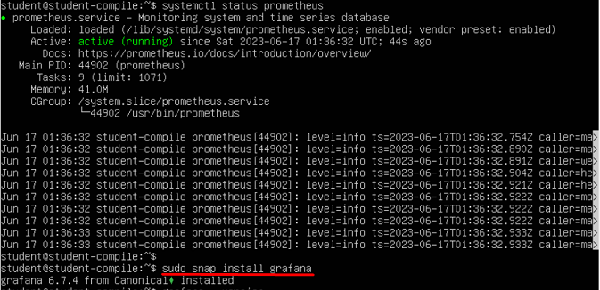

## Part 7. **Prometheus** и **Grafana**

### Установить и настроить **Prometheus** и **Grafana** на виртуальную машину

- Установка **Prometheus**:\

- Проверка статуса (Prometheus запущен):\

- Установка **Grafana**:\

- Проброс портов для соединения виртуалки с локальной машиной:\

### Получить доступ к веб интерфейсам **Prometheus** и **Grafana** с локальной машины

- Веб-интерфейс **Prometheus**:\

- Веб-интерфейс **Grafana** (с настройкой источника данных - Prometheus'a):\

### Добавить на дашборд **Grafana** отображение ЦПУ, доступной оперативной памяти, свободное место и кол-во операций ввода/вывода на жестком диске

### Запустить bash-скрипт из [Части 2](#)

### Посмотреть на нагрузку жесткого диска (место на диске и операции чтения/записи)
- Место на диске:\

- Количество операций чтения/записи:\

### Установить утилиту **stress** и запустить команду `stress -c 2 -i 1 -m 1 --vm-bytes 32M -t 10s`
- установка утилиты **stress**:\

- запуск команды:\

### Посмотреть на нагрузку жесткого диска, оперативной памяти и ЦПУ
- дашборд с метриками (запуск команды в 13:11:30, утилита проработала 10 секунд):\
