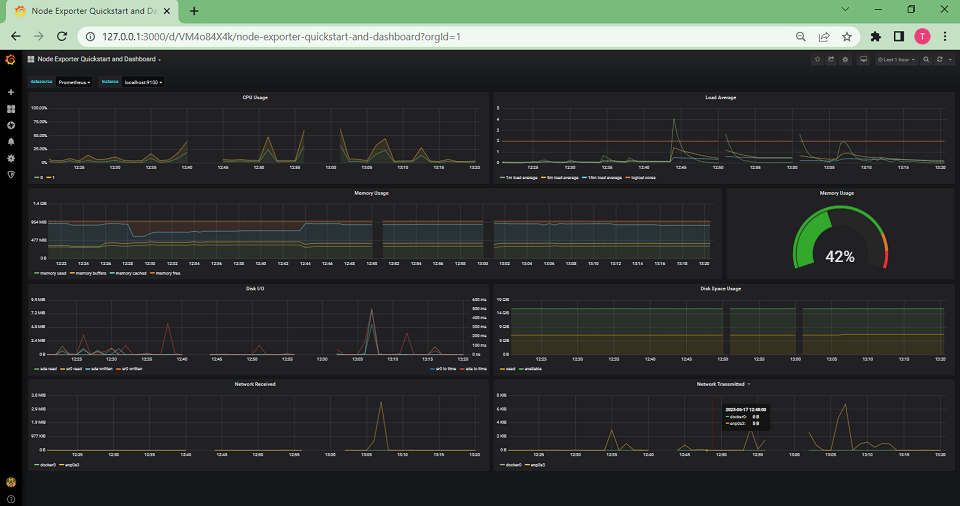
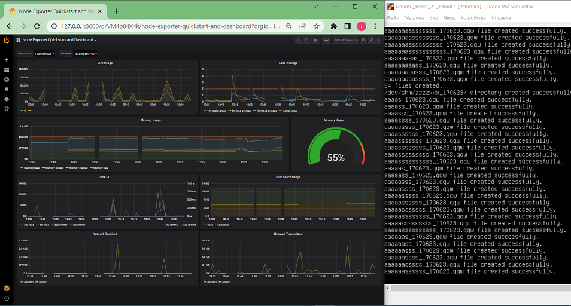
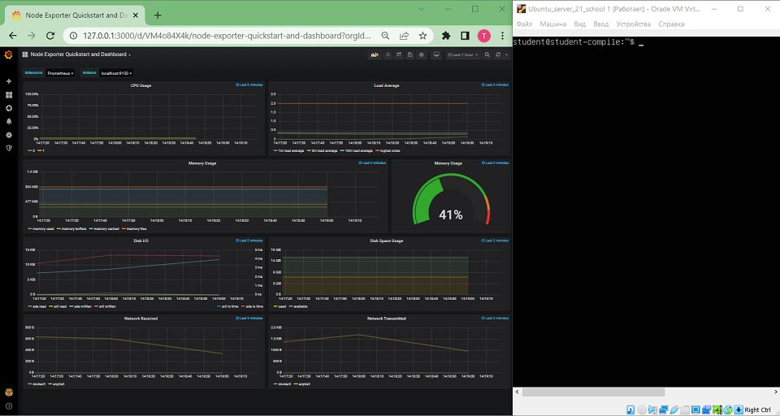
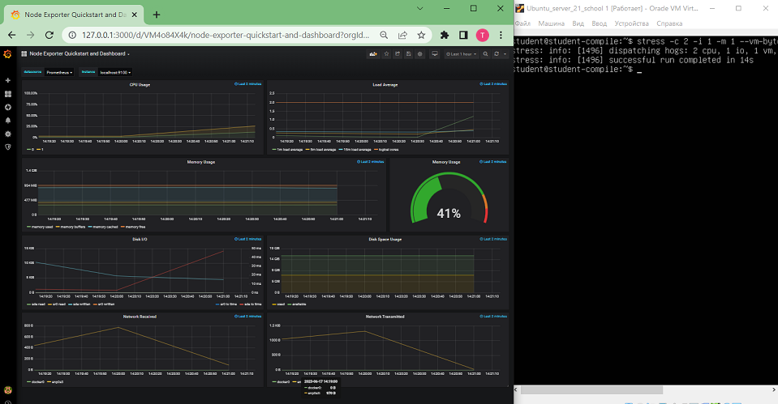
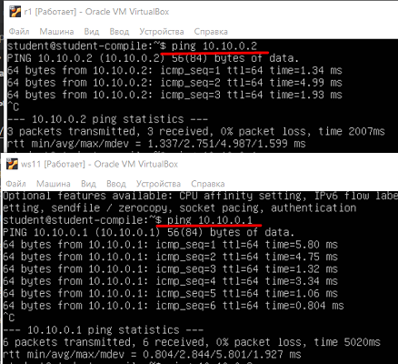
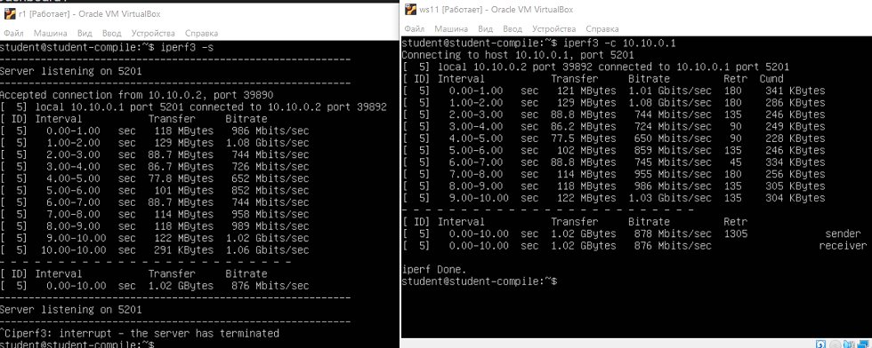
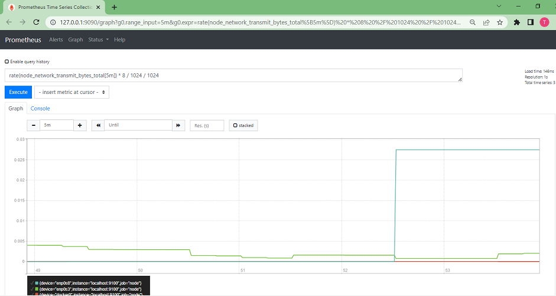
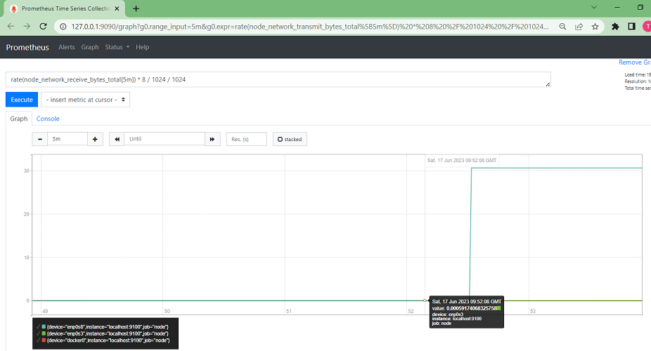
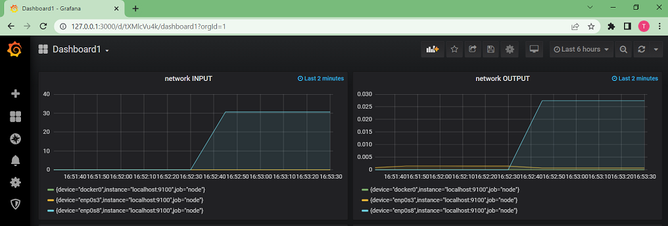

## Part 8. Готовый дашборд

### Установить готовый дашборд *Node Exporter Quickstart and Dashboard* с официального сайта **Grafana Labs**
- готовый дашборд:\

### Провести те же тесты, что и в [Части 7](#part-7-prometheus-и-grafana)
- запуск скрипта из Part 2:\

- запуск утилиты **stress**:\
  - до запуска \
  

  - после запуска \
  

### Запустить ещё одну виртуальную машину, находящуюся в одной сети с текущей
- две машины запущены, пингуются друг с другом (**r1** - на ней установлены Prometheus и Grafana, и **ws11**):\

### Запустить тест нагрузки сети с помощью утилиты **iperf3**
- команда **iperf3** (машина **r1** - сервер, машина **ws11** - клиент):\

### Посмотреть на нагрузку сетевого интерфейса
- нагрузка сетевого интерфейса в Prometheus'e:\

- нагрузка сетевого интерфейса в Grafana:\

