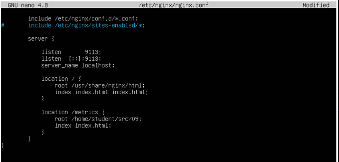
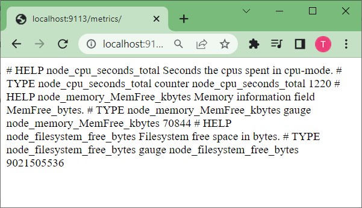
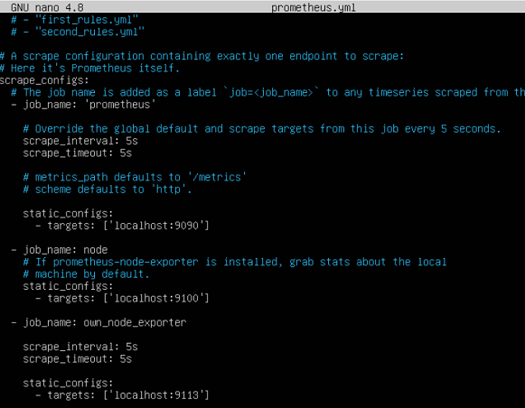
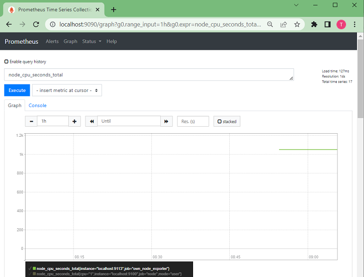
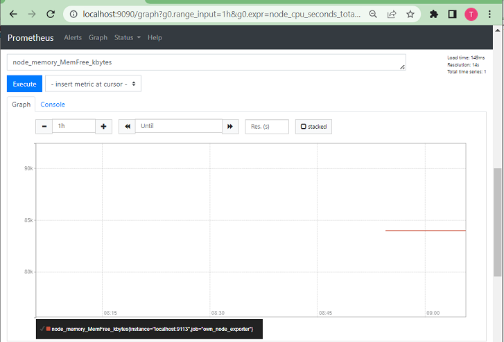
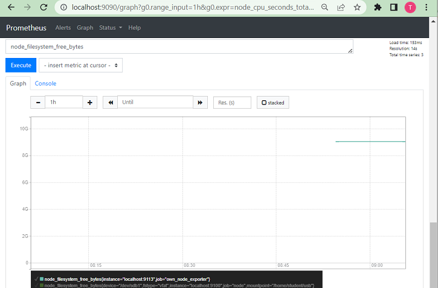

## Part 9. Дополнительно. Свой *node_exporter*

Написать bash-скрипт или программу на Си, которая собирает информацию по базовым метрикам системы (ЦПУ, оперативная память, жесткий диск (объем)).

Скрипт или программа должна формировать html страничку по формату **Prometheus**, которую будет отдавать **nginx**.
- часть конфигурационного файла **nginx**, формирует и отдает html-страничку\

- страничка с данными в браузере на локальной машине (в VirtualBox проброшен порт 9113 для этого):\

Саму страничку обновлять можно как внутри bash-скрипта или программы (в цикле), так и при помощи утилиты cron, но не чаще, чем раз в 3 секунды.

### Поменять конфигурационный файл **Prometheus**, чтобы он собирал информацию с созданной вами странички.
- содержимое конфигурационного файла */etc/prometheus/prometheus.yml*:\

- работа **Prometheus**а с новыми настройками:\

#### Провести те же тесты, что и в [Части 7](#part-7-prometheus-и-grafana)

