# Simple Docker

Введение в докер. Разработка простого докер образа для собственного сервера.

## Contents

1. [Готовый докер](#part-1-готовый-докер)
2. [Операции с контейнером](#part-2-операции-с-контейнером)
3. [Мини веб-сервер](#part-3-мини-веб-сервер)
4. [Свой докер](#part-4-свой-докер)
5. [Dockle](#part-5-dockle)
6. [Базовый Docker Compose](#part-6-базовый-docker-compose)

В качестве результата работы по первым двум задачам должен быть предоставлен отчет.
В каждой части задания указано, что должно быть помещено в отчёт, после её выполнения.
Это могут быть ответы на вопросы, скриншоты и т.д.

В качестве результата работы по третьей задаче должны быть предоставлены исходные файлы для запуска веб-сервера.

В качестве результата работы по четвёртой и пятой задачам должны быть предоставлены докерфайлы.

В качестве результата работы по шестой задаче должен быть предоставлен файл *docker-compose.yml* и нужные для его запуска докерфайлы (если они не были предоставлены ранее).

- В репозиторий, в папку src, должен быть загружен отчёт с расширением .md.
- В отчёте должны быть выделены все части задания, как заголовки 2-го уровня.
- В рамках одной части задания всё, что помещается в отчёт, должно быть оформлено в виде списка.
- Каждый скриншот в отчёте должен быть кратко подписан (что показано на скриншоте).
- Все скриншоты обрезаны так, чтобы была видна только нужная часть экрана.
- На одном скриншоте допускается отображение сразу нескольких пунктов задания, но они все должны быть описаны в подписи к скриншоту.
- В репозиторий, в папку src/server, должны быть загружены исходные файлы для запуска веб-сервера из третьего задания.
- В репозиторий, в папку src, должны быть загружены итоговые докерфайлы для запуска образов из четвёртого и пятого заданий.
- В репозиторий, в папку src, должен быть загружен *docker-compose.yml* шестого задания.
- Необходимо быть готовым продемонстрировать решение вживую при необходимости.

## Part 1. Готовый докер

**== Задание ==**

##### Взять официальный докер образ с **nginx** и выкачать его при помощи `docker pull`
##### Проверить наличие докер образа через `docker images`
##### Запустить докер образ через `docker run -d [image_id|repository]`
##### Проверить, что образ запустился через `docker ps`
##### Посмотреть информацию о контейнере через `docker inspect [container_id|container_name]`
##### По выводу команды определить и поместить в отчёт размер контейнера, список замапленных портов и ip контейнера
##### Остановить докер образ через `docker stop [container_id|container_name]`
##### Проверить, что образ остановился через `docker ps`
##### Запустить докер с портами 80 и 443 в контейнере, замапленными на такие же порты на локальной машине, через команду *run*
##### Проверить, что в браузере по адресу *localhost:80* доступна стартовая страница **nginx**
##### Перезапустить докер контейнер через `docker restart [container_id|container_name]`
##### Проверить любым способом, что контейнер запустился

- В отчёт поместить скрины:
  - вызова и вывода всех использованных в этой части задания команд;
  - стартовой страницы **nginx** по адресу *localhost:80* (адрес должен быть виден).
  
*Замечание:* **Не загружайте тяжелые файлы (>10 мб) в гит.**

##### **Отчёт**
- Выкачиваем официальный докер образ с **nginx**:\
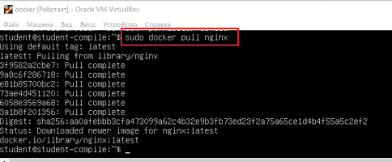

- Проверка наличия докер образа:\
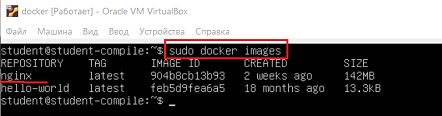

- Запуск докер образа и проверка, что образ запустился:\
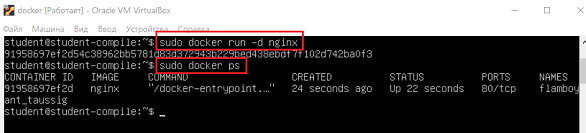

- Просмотр информации о контейнере. Необходимо определить размер контейнера, список замапленных портов и ip контейнера:\
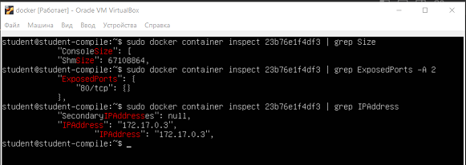

- Остановка докер образа:\
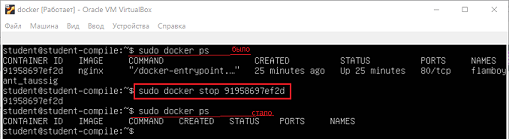

- Запуск докера с портами 80 и 443 в контейнере, замапленными на такие же порты на локальной машине:\
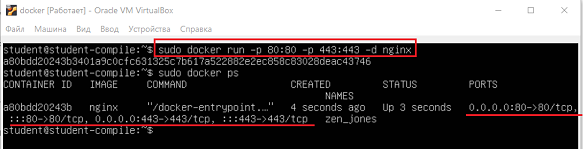

- Проверка, что в браузере по адресу *localhost:80* доступна стартовая страница **nginx**:
  - через утилиту `curl`:\
  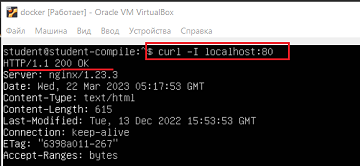
  - с помощью веб-браузера для терминала *Links*:\
  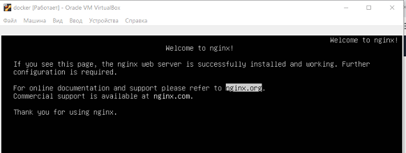

- Перезапуск докер контейнера и проверка, что он запустился:\
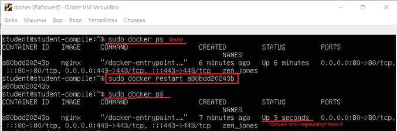

## Part 2. Операции с контейнером

**== Задание ==**

##### Прочитать конфигурационный файл *nginx.conf* внутри докер контейнера через команду *exec*
##### Создать на локальной машине файл *nginx.conf*
##### Настроить в нем по пути */status* отдачу страницы статуса сервера **nginx**
##### Скопировать созданный файл *nginx.conf* внутрь докер образа через команду `docker cp`
##### Перезапустить **nginx** внутри докер образа через команду *exec*
##### Проверить, что по адресу *localhost:80/status* отдается страничка со статусом сервера **nginx**
##### Экспортировать контейнер в файл *container.tar* через команду *export*
##### Остановить контейнер
##### Удалить образ через `docker rmi [image_id|repository]`, не удаляя перед этим контейнеры
##### Удалить остановленный контейнер
##### Импортировать контейнер обратно через команду *import*
##### Запустить импортированный контейнер
##### Проверить, что по адресу *localhost:80/status* отдается страничка со статусом сервера **nginx**

- В отчёт поместить скрины:
  - вызова и вывода всех использованных в этой части задания команд;
  - содержимое созданного файла *nginx.conf*;
  - страницы со статусом сервера **nginx** по адресу *localhost:80/status*.

##### **Отчёт**
- Содержимое конфигурационного файла *nginx.conf* внутри докер контейнера:\
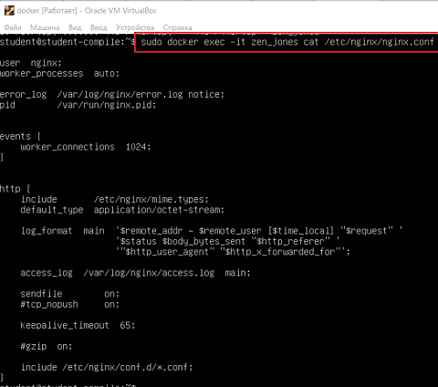

- Содержимое созданного файла *nginx.conf* на локальной машине (секция *server*):\
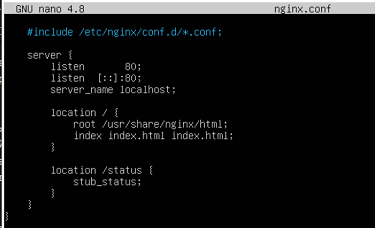

- Копирование файла *nginx.conf* внутрь докер образа и перезапуск конфигурации:\
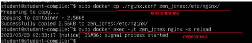

- Проверка, что по адресу *localhost:80/status* отдается страничка со статусом сервера **nginx**:
  - через утилиту *curl*:\
  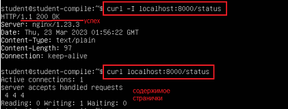

  - через консольный браузер *Links*:\
  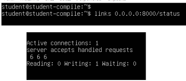

- Экспорт контейнера в файл *container.tar*:\
  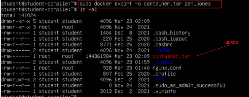

- Остановка контейнера, удаление образа без удаления контейнера:\
  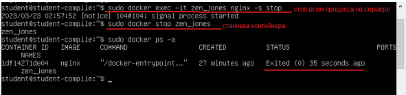

  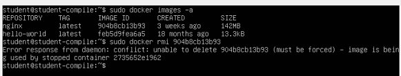\
  Попытка удаления образа неудачная, т.к. образ связан с остановленным контейнером, без удаления контейнера образ не удалится.

- Удаление остановленного контейнера:\
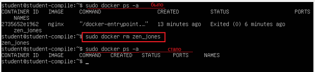

- Импорт контейнера обратно:\
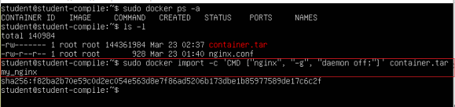

- Запуск импортированного контейнера:\
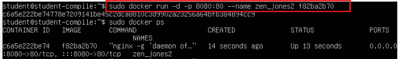

- Проверка, что по адресу *localhost:80/status* отдается страничка со статусом сервера **nginx**:\
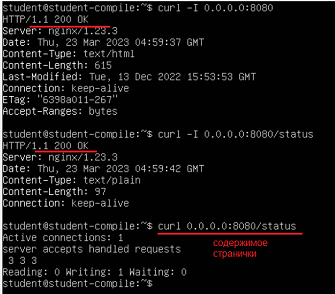
