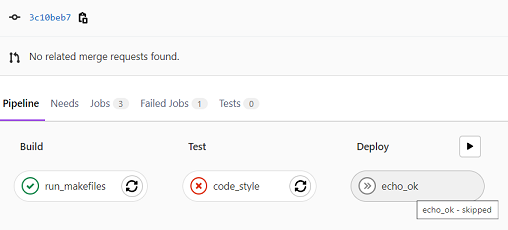
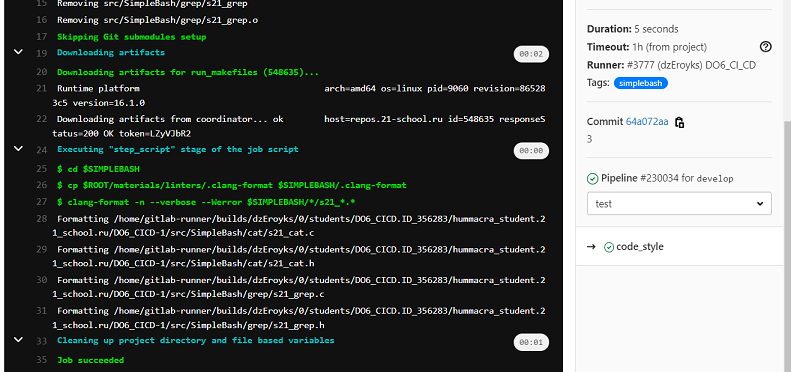
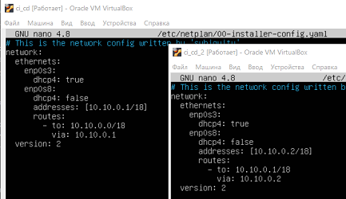

# Basic CI/CD

## Part 1. Настройка **gitlab-runner**

### Поднять виртуальную машину *Ubuntu Server 20.04 LTS*
*Будьте готовы, что в конце проекта нужно будет сохранить дамп образа виртуальной машины*

- Импортируем систему из образа, запускаем и обновляем:

    `sudo apt update`

    `sudo apt upgrade`

### Скачать и установить на виртуальную машину **gitlab-runner**
- предварительно настраиваем репозиторий, откуда загружать *gitlab-runner*:

    `curl -L "https://packages.gitlab.com/install/repositories/runner/gitlab-runner/script.deb.sh" | sudo bash`

- скачиваем и устанавливаем саму программу:

    `sudo apt install gitlab-runner`

### Запустить **gitlab-runner** и зарегистрировать его для использования в текущем проекте (*DO6_CICD*)
*Для регистрации понадобятся URL и токен, которые можно получить на страничке задания на платформе.*

- запуск службы:

    `sudo systemctl enable gitlab-runner --now gitlab-runner`

- проверка того, что *gitlab-runner* запущен и работает:

    `sudo systemctl status gitlab-runner`

    `sudo gitlab-runner verify` (должно быть *is_alive*)

    

- регистрация для использования в проекте (со страницы https://edu.21-school.ru/project/.../task):

    `sudo gitlab-runner register`

    задаём параметры регистрации:

    ```
    Адрес сервера с GitLab:
    Enter the GitLab instance URL (for example, https://gitlab.com/):
    https://repos.21-school.ru
    ```
    ```
    Токен для регистрации раннера:
    Enter the registration token:
    eM-uE75JyFdyFmsTXgq7
    ```
    ```
    Enter a description for the runner:
    не задано (_Enter_)
    ```
    ```
    Enter tags for the runner (comma-separated):
    simplebash

    (*если у задачи не указан тег раннера, который ее должен выполнять, то она не выполнится*)
    ```

    ```
    Enter an executor:
    shell
    ```

- также понадобится склонировать репозитории проектов *DO6_CICD* и *C2_SimpleBashUtils*.


## Part 2. Сборка

### Написать этап для **CI** по сборке приложений из проекта *C2_SimpleBashUtils*:

#### В файле `.gitlab-ci.yml` добавить этап запуска сборки через мейк файл из проекта _C2_

#### Файлы, полученные после сборки (артефакты), сохранять в произвольную директорию со сроком хранения 30 дней.

- содержимое файла `.gitlab-ci.yml` (stage `build`, job `run_makefiles`):\
   

- результат работы пайплайна в репозитории:

    отчет о работе *runner'a*\
    

    содержимое папки с артефактами\
    


## Part 3. Тест кодстайла

### Написать этап для **CI**, который запускает скрипт кодстайла (*clang-format*):

#### Если кодстайл не прошел, то "зафейлить" пайплайн

#### В пайплайне отобразить вывод утилиты *clang-format*

- содержимое файла `.gitlab-ci.yml` (stage `test`, job `code_style`):\
    \
    *Job `echo_ok` добавлена, чтобы показать, что пайплайн фейлится, если тесты не прошли*

- два результата работы конвейера (в первом - сделана намеренная ошибка в стиле, чтобы показать, что пайплайн будет зафейлен, во втором пайплайн прошел все стадии):\
    

- первый результат более подробно (с ошибкой в код-стайле):\
    

    

- второй результат более подробно (без ошибки в код-стайле):\
    

    


## Part 4. Интеграционные тесты

### Написать этап для **CI**, который запускает ваши интеграционные тесты из того же проекта:
- содержимое файла `.gitlab-ci.yml` (stage `test`, job `tests`). :\
    \
    *Job `echo_ok` добавлена, чтобы показать, что пайплайн фейлится, если тесты не прошли*

#### Запускать этот этап автоматически только при условии, если сборка и тест кодстайла прошли успешно
- это делается секцией 
    ```
    when: on_success
    ```
#### Если тесты не прошли, то "зафейлить" пайплайн
- Если интергационый тест дает строку `FAIL` в вывод, то gitlab не поймет, что не все тесты прошли успешно. Ему нужно завершение самой программы с ошибкой. Чтобы gitlab увидел неудачное завершение программы, я дописала в тестирующие скрипты выход с значением 1 или 0:\
    

- "зафейлить" пайплайн - это секция 
    ```
    allow_failure: false
    ```
- два результата работы конвейера (первый - с фейлом, т.к. не все тесты правильно отработали; второй - без фейла, все тесты прошли успешно, все stage выполнены):\
    

- несколько тестов в s21_grep отработали неправильно:\
    

- все тесты отработали успешно:\
    

#### В пайплайне отобразить вывод, что интеграционные тесты успешно прошли / провалились
- сообщение о результатах запуска интеграционных тестов:\
    


## Part 5. Этап деплоя

### Поднять вторую виртуальную машину *Ubuntu Server 20.04 LTS*
- чтобы две машины увидели друг друга по сети, необходимо в настройках `VirtualBox` у машин включить второй сетевой адаптер (внутренняя сеть), и настроить сетевую конфигурацию (как в проекте *DO2_LinuxNetwork*), через редактирование файла `/etc/netplan/00-installer-config.yaml`:\
    

    Первая машина находится в сети по IP-адресу 10.10.0.1, вторая машина - по IP-адресу 10.10.0.2 (их можно пропинговать).

- проверяем, что на обеих машинах служба ssh запущена и работает (команда `systemctl status sshd`):\
    

- чтобы подключиться по ssh с первой машины к второй, по логину и паролю:
    ```
    ssh student@10.10.0.2
    ```
    Появится запрос на ввод пароля. При первом подключении также будет предложение добавить новое устройство в список известных. Вводим `yes`, нажимаем Enter.

    Если подключение удалось, оказываемся в режиме удаленного доступа. Теперь все команды, которые введём в терминале, будут выполняться на второй машине.
    Чтобы работать от лица первой машины, надо запустить второй терминал (`Atl + F2`).


### Написать этап для **CD**, который "разворачивает" проект на другой виртуальной машине:

### Запускать этот этап вручную при условии, что все предыдущие этапы прошли успешно
- для этого в файле _gitlab-ci.yml_ вставляем секцию в job `copy`:
    ```
    when: manual
    ```

### Написать bash-скрипт, который при помощи **ssh** и **scp** копирует файлы, полученные после сборки (артефакты), в директорию */usr/local/bin* второй виртуальной машины
*Тут вам могут помочь знания, полученные в проекте DO2_LinuxNetwork*

*Будьте готовы объяснить по скрипту, как происходит перенос.*

- перед копированием файлов надо дать права для записи в папку `/usr/local/bin/` на второй машине:
    ```
    sudo chmod 777 /usr/local/bin/
    ```

- ставим утилиту `expect` на первую машину (нужна, чтобы скрипт сам ввел пароль при подключении по ssh):
    ```
    sudo apt install expect
    ```

- скрипт `main.sh`, который подключается и вызывает скрипт копирования `copy.sh`:
    

- результат работы скрипта (файлы скопированы с первой машины на вторую автоматически):\
    

### В файле _gitlab-ci.yml_ добавить этап запуска написанного скрипта
- содержимое файла `.gitlab-ci.yml` (stage `deploy`, job `copy`):\
    

    *Еще пришлось внести в репозиторий `ssh-ключ`, сгенерированный на второй машине, и изменить скрипты `main.sh` и `copy.sh`, т.к. в репозитории другие пути*

- новое содержимое скриптов `main.sh` и `copy.sh` для запуска из репозитория:\
    

### В случае ошибки "зафейлить" пайплайн
- вставляем секцию 
    ```
    allow_failure: false
    ```

В результате вы должны получить готовые к работе приложения из проекта *C2_SimpleBashUtils* (s21_cat и s21_grep) на второй виртуальной машине.
- результат работы скрипта (файлы скопированы из репозитория на вторую машину после запуска job `copy`):\
    

    

    

### Сохранить дампы образов виртуальных машин
**p.s. Ни в коем случае не сохранять дампы в гит!**
- Не забудьте запустить пайплайн с последним коммитом в репозитории.


## Part 6. Дополнительно. Уведомления

### Настроить уведомления о успешном/неуспешном выполнении пайплайна через бота с именем "[ваш nickname] DO6 CI/CD" в *Telegram*

*Текст уведомления должен содержать информацию об успешности прохождения как этапа **CI**, так и этапа **CD**.*

*В остальном текст уведомления может быть произвольным.*

Действуем по инструкции в `./materials/notifications.md`:
- Create a telegram bot:
    1. Открыть в Telegram бота @BotFather (или `https://telegram.me/BotFather`).

    2. Написать ему `/newbot`.

    3. Написать название бота (`[HUMMACRA] DO6 CI/CD`). Оно будет отображаться в контактах и чатах.

    4. Придумать и написать юзернейм. Он используется для упоминания бота и в ссылках. Юзернейм должен быть на латинице и обязательно заканчиваться на «bot». Например, «botmother_hello_bot».

- Send the bot a message to get it set up to work with the user (you):\
    

- To send notifications in a convenient way, create a bash script, which will call API Telegram and send a message to the right user through the created bot.

    - Файл `.gitlab-ci.yml`, изменения в stage `test`, job `tests` и в stage `deploy`, job `copy` (появилась секция `after_script`, в ней вызывается скрипт для отправки сообщения боту):\
    

    - Скрипт `message.sh`, который вызывается в `.gitlab-ci.yml`:\
    

    - Сообщения от бота:\
    
